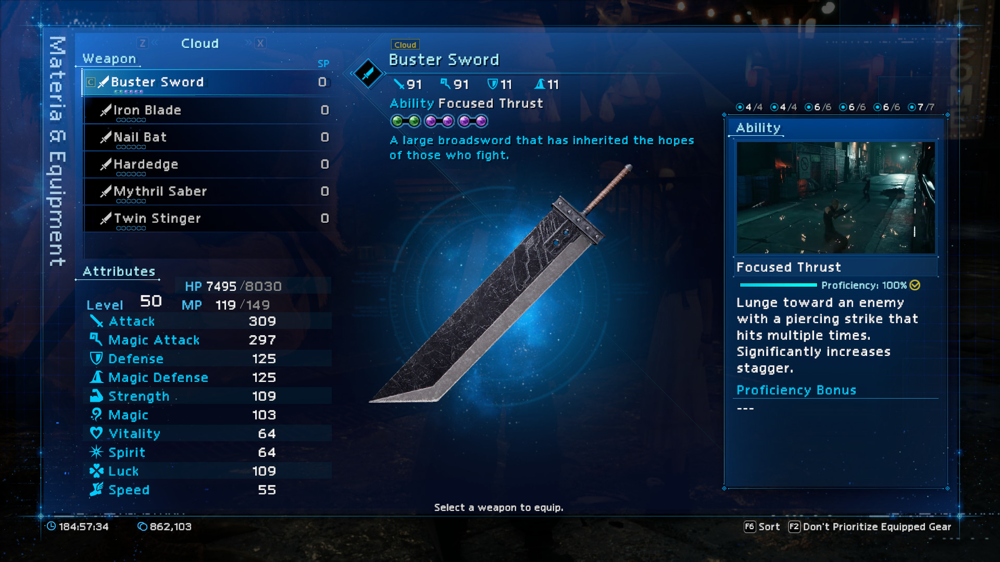

# FF7R Font Mod Tools

Tools for importing font data (`.ttf`) into FF7R (Final Fantasy VII Remake)

 

## Requirements

- [BMFont](https://www.angelcode.com/products/bmfont/): Generates bitmap textures (`.dds`) and a font descriptor file (`.fnt`) from `.ttf`.
- [NVIDIA Texture Tools](https://developer.nvidia.com/nvidia-texture-tools-exporter): Converts bitmap textures to BC5 format.

## Overview

- `FF7R.bmfc`: Configuration file for BMFont.
- `dds_to_bc5.bat`: Batch file for running NVIDIA Texture Tools with CLI.
- `fnt_importer`: Tool for importing font descriptior from `.fnt` into `.uexp`.
- `font_4Ktexture_replacer`: DDS replacer for font bitmap.

## Q&A

### Is it possible to import the characters the game does not support?

Yes, I imported Vietnamese font with my tool. 
 
[DEMO FINAL FANTASY VII REMAKE VIỆT HOÁ - YouTube](https://youtu.be/SgKesZkevRc) 
 

### Is the .exe file malware? My antivirus reports it as containing a virus.
No, it is a false positive caused by pyinstaller. 
 
[AVG (and other antiviruses) reports exe file as containing virus · Issue #603 · pyinstaller/pyinstaller](https://github.com/pyinstaller/pyinstaller/issues/603) 
 
If you are worried about the security, please run the Python scripts instead of the .exe file. 
 

